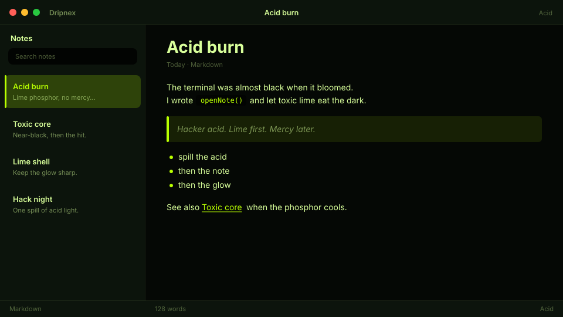

# Acid

Hacker acid. Toxic lime on near-black.



```
dripnex/theme-acid
```

## Palette

The chips live in [palette.html](palette.html) — open it in a browser. GitHub won’t paint HTML swatches here, so the hex list is below.

| Name | Token | Color | What it’s for |
| --- | --- | --- | --- |
| Base | `--bg-base` | `#050805` | Window background |
| Surface | `--bg-surface` | `#0c140c` | Sidebar and chrome |
| Elevated | `--bg-elevated` | `#142014` | Raised panels |
| Text | `--text-primary` | `#d8ff9a` | Headings and body |
| Muted | `--text-muted` | `#d8ff9a · rgba(216, 255, 154, 0.52)` | Secondary copy |
| Accent | `--accent` | `#b8ff00` | Selection and links |
| Active | `--status-active` | `#b8ff00` | Active status |
| Dropped | `--status-dropped` | `#ff5a5a` | Dropped status |

Pick it when you want toxic lime on near-black.
